# Pathment — Database Schema & ER Diagrams

> **Audience:** new contributors and anyone who wants to understand how Pathment's
> data fits together, zero to hero. This document is the single source of truth for
> the data model. It is generated from the Sequelize models under
> [`server/src/models/`](../server/src/models) — when you change a model, update the
> matching diagram here.

The diagrams below use [Mermaid](https://mermaid.js.org/syntax/entityRelationshipDiagram.html),
which renders natively on GitHub. If you're reading this in an editor without Mermaid,
paste a block into the [Mermaid Live Editor](https://mermaid.live).

**Relationship cardinality cheat-sheet**

| Symbol | Meaning |
| --- | --- |
| `||--o{` | one-to-many (one A has many B) |
| `||--||` | one-to-one |
| `}o--o{` | many-to-many (via a join table) |
| `||--o|` | one-to-zero-or-one (optional) |

---

## 1. Conventions (read this first)

Every model follows the same rules, so the diagrams only show what is *distinctive*
about each table.

- **Primary keys** are `UUID` (`id`, `defaultValue: UUIDV4`) unless noted.
- **Column naming** is `underscored` in Postgres (`first_name`) and `camelCase` in JS
  (`firstName`). Diagrams use the JS names.
- **Timestamps** (`created_at`, `updated_at`) exist on most tables; a few are
  `timestamps: false` or `updatedAt: false` (append-only logs).
- **Soft deletes** (`paranoid`, adds `deleted_at`) are used on `users`, `programs`,
  and `two_factor_auths`.
- **Models auto-load** recursively from `server/src/models/**` via
  [`server/src/db/index.js`](../server/src/db/index.js); each model's `associate()`
  runs after all models are registered.
- **Foreign keys** are not always declared as DB-level constraints; relationships are
  expressed through Sequelize associations. The diagrams reflect the *logical* model.

**Domain map** (83 models across 10 domains):

| Domain | Folder | What it owns |
| --- | --- | --- |
| Users & Profiles | `models/users/` | User identity, role-specific profiles, skills, mentor notes |
| Auth & Tokens | `models/auth/` | Sessions, refresh/reset/verify tokens, 2FA, **registration invites** |
| Programs & Community structure | `models/programs/` | Programs, **cohorts**, clans, memberships, roadmaps, reviews |
| Intake | `models/intake/` | **Applications** + **Assessments** (public/import intake into a cohort) |
| Roadmaps & Tasks | `models/tasks/` | Enrollments, assigned tasks, submissions, feedback, blockers |
| Messaging | `models/messaging/` | Conversations, messages, reactions, notifications |
| Gamification | `models/gamification/` | Badges, points, challenges, leaderboards, gifts |
| Scheduling | `models/scheduling/` | Availability, meetings, notes, schedule templates |
| Analytics | `models/analytics/` | Per-user/program/task rollups, activity, skill assessments |
| System & Community feed | `models/system/` | Announcements, community posts, settings, audit, files, AI keys |

---

## 2. The spine — core entities at a glance

This is the 20% of the schema that explains 80% of the product: how a person becomes
a placed, enrolled mentee working through tasks inside a clan.

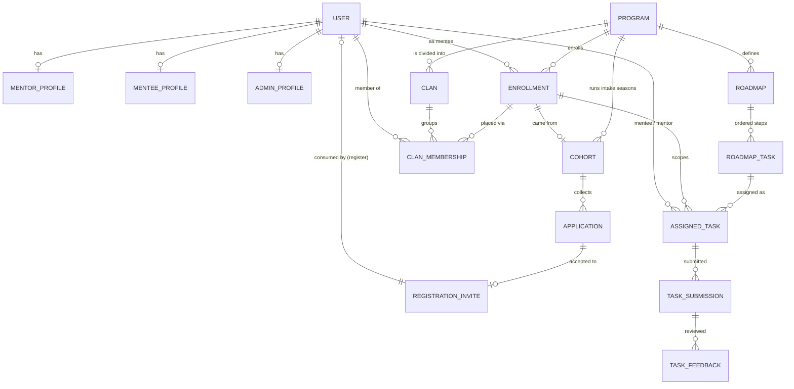

**Read it as a life-cycle:**

1. **Apply** — a person submits an `APPLICATION` into an open `COHORT` (of a `PROGRAM`).
2. **Accept** — an admin accepts it, which issues a `REGISTRATION_INVITE` carrying the
   `programId` + optional `clanId` + `cohortId`.
3. **Register** — the invite is consumed at sign-up, creating the `USER` (+ profile).
4. **Place** — registration creates an `ENROLLMENT` (program + cohort) and a
   `CLAN_MEMBERSHIP` (the clan), linked together by `enrollmentId`.
5. **Work** — the program's `ROADMAP` → `ROADMAP_TASK`s are handed out as
   `ASSIGNED_TASK`s; the mentee files `TASK_SUBMISSION`s; the mentor leaves
   `TASK_FEEDBACK`. `ENROLLMENT` progress is recomputed from the assigned tasks.

---

## 3. Users & Profiles (`models/users/`)

A single `User` row is the identity; role-specific data lives in one-to-one profile
tables. `capabilities` is a superset array of roles so one person can hold multiple
views (e.g. a mentee who is also an admin).

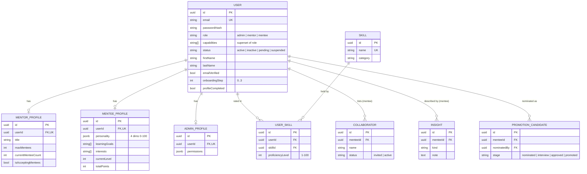

---

## 4. Auth & Tokens (`models/auth/`)

Stateless JWT access tokens + DB-backed refresh/reset/verify tokens. **Registration is
invite-only**: `RegistrationInvite` is the bridge between intake and a real account, and
it carries the user's eventual placement.

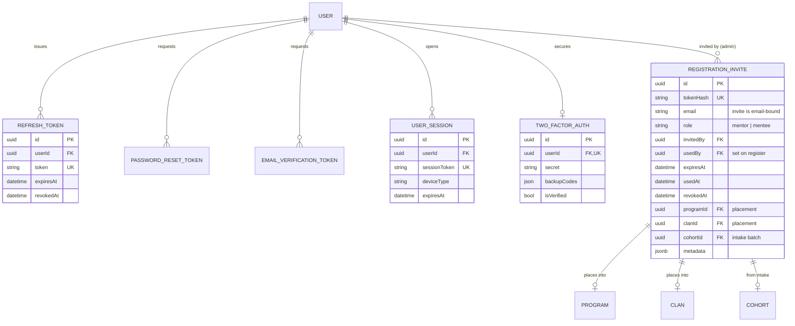

---

## 5. Programs, Cohorts & Clans (`models/programs/`)

A `Program` is the offering. A `Cohort` is a *season of intake* for that program (only
an `open` cohort accepts applications). A `Clan` is a mentor-led group of mentees inside
the program; `ClanMembership` records who is in it and in what role.

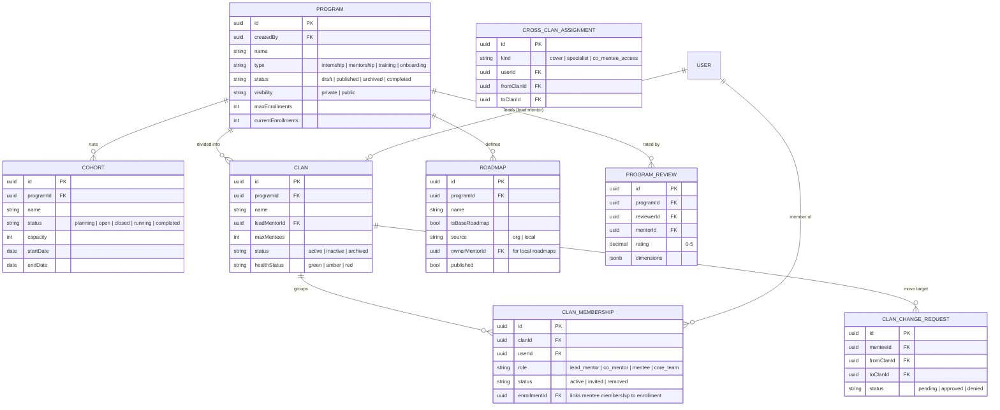

---

## 6. Intake & Applications (`models/intake/`)

The intake layer. An `Application` is a person's request to join a cohort. Its free-form
answers live in `responses` (JSONB) so the intake form can change without migrations.
On accept, it spawns a `RegistrationInvite` and (once they register) links back to the
`User`.

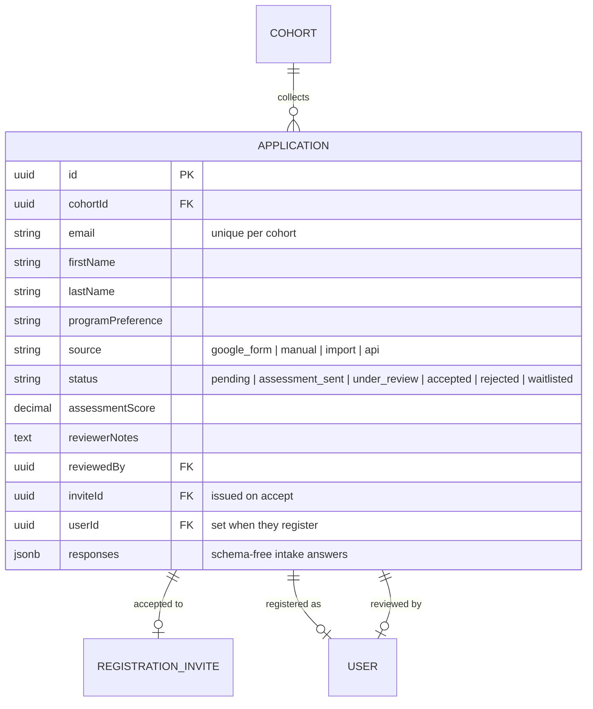

### Self-serve intake + assessments

A `Cohort` can expose a **public shareable link** (`publicSlug` + `publicEnabled`,
gated by `status='open'`, an optional `applyOpensAt`/`applyClosesAt` window, and a
`maxApplications` cap) and optionally attach an **Assessment** (`assessmentId` +
`assessmentRequired`). An `Application` carries an `accessTokenHash` magic-link so a
not-yet-registered applicant can return to track status and take the assessment without
an account. Assessments are admin-built, mixed-type, and (where possible) auto-graded.

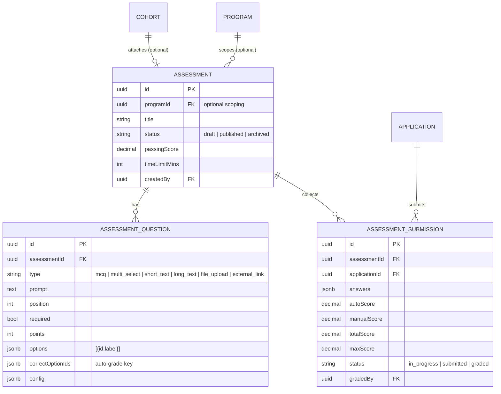

---

## 7. Roadmaps & Tasks (`models/tasks/`)

The execution engine. An `Enrollment` is the mentee↔program link and the unit of
progress. `RoadmapTask` is a template step; `AssignedTask` is an instance handed to a
specific mentee. Submissions are versioned; feedback attaches to a submission version.

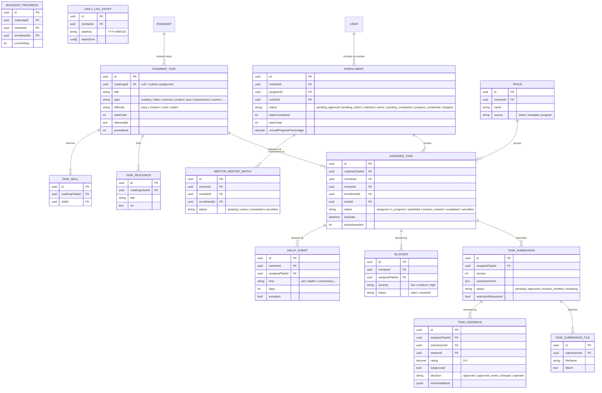

> `Enrollment` progress (`tasksTotal`, `tasksCompleted`, `overallProgressPercentage`,
> `status`) is recomputed by `taskService.updateEnrollmentTaskStats` on every
> assign/submit/review — it is the **single source of truth** for progress. Total counts
> live (non-cancelled) assigned tasks, not the template, so progress never shows a false 100%.

---

## 8. Messaging (`models/messaging/`)

Real-time 1:1 chat over Socket.IO plus a notification feed. Messages carry WhatsApp-style
receipts (`deliveredAt`, `readAt`) and emoji `reactions`.

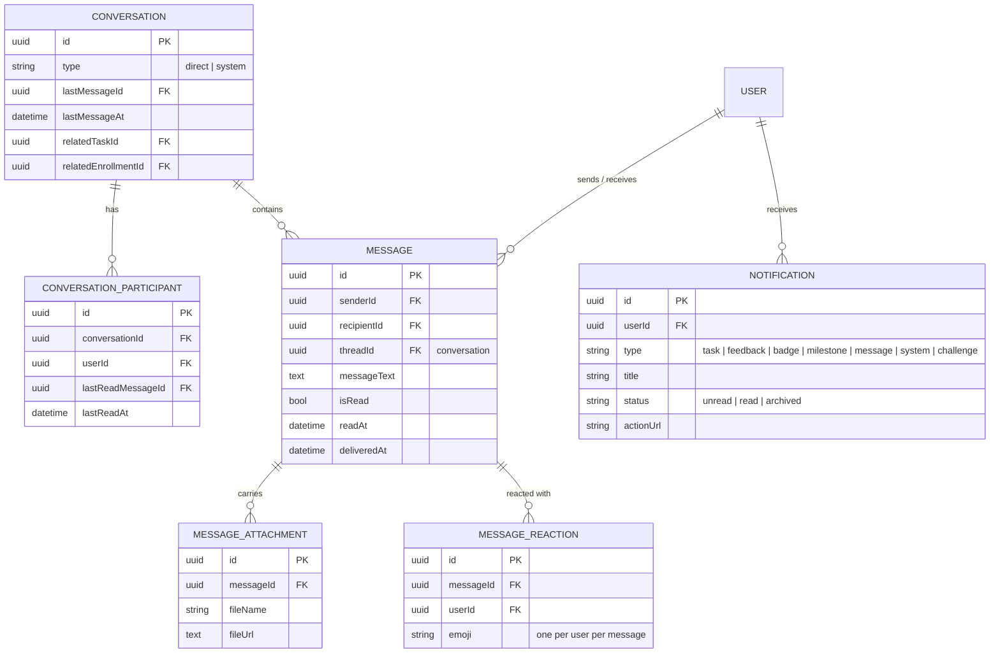

---

## 9. Gamification (`models/gamification/`)

Points, badges, challenges, leaderboards, and an XP-priced gift catalog.

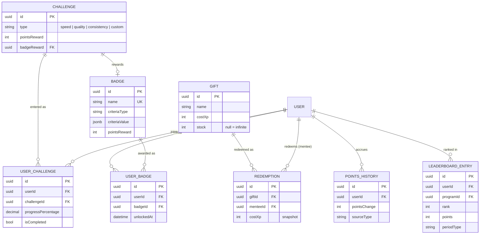

---

## 10. Scheduling (`models/scheduling/`)

Mentor availability, booked meetings, post-meeting notes, and reusable schedule templates.

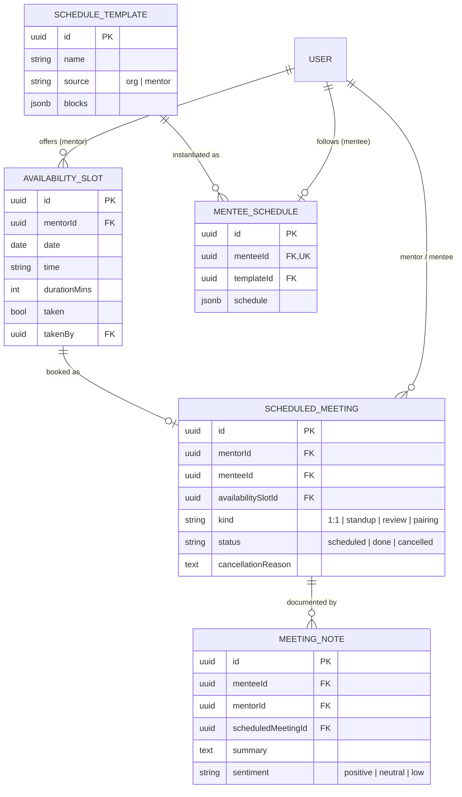

---

## 11. Analytics (`models/analytics/`)

Pre-computed rollups (refreshed by scheduled jobs) plus raw activity/event streams.
These are mostly read-only reporting tables keyed by entity + period.

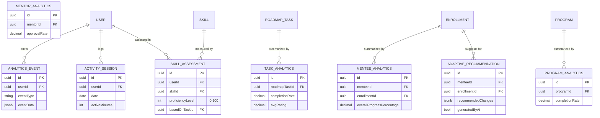

---

## 12. System & Community feed (`models/system/`)

Cross-cutting platform tables: the scoped community feed (clan/cohort/program/global),
announcements, settings, audit, file uploads, the Mentor Spec handbook (`OrgPolicy`), and
bring-your-own-key AI connections.

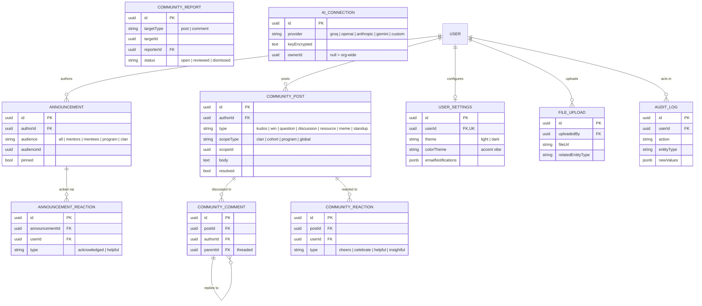

> Other system tables not drawn (no foreign-key relationships, or singletons):
> `Document`, `OrgPolicy`, `EmailQueue`, `ScheduledJob`, `SystemSettings`.

---

## 13. Migrations

Schema changes are idempotent, numbered scripts in
[`server/scripts/migrations/`](../server/scripts/migrations) (`NNN_description.js`, each
with `up`/`down`, run with `--rollback` to reverse). The latest is **043**. Notable ones:

| # | What it added |
| --- | --- |
| 005 | Registration invites |
| 007 | Capabilities & clans |
| 030 | Private programs + invite placement |
| 031 | Intake cohorts & applications |
| 032 | Community v2 (scoped posts, reactions, reports) |
| 035–036 | AI connections (bring-your-own-key) |
| 037 | Program reviews |
| 040–041 | User color theme + preferences |
| 042 | Message delivery receipts + reactions |
| 043 | Public intake links + assessments (cohort link/window/cap, applicant magic-link, assessment tables) |

Run all pending migrations against your DB with the project's migration runner (see
[`server/DATABASE_SETUP.md`](../server/DATABASE_SETUP.md)).

---

*Keep this document honest:* when you add or change a model, update the relevant diagram
and the domain map. A diagram that lies is worse than no diagram.
